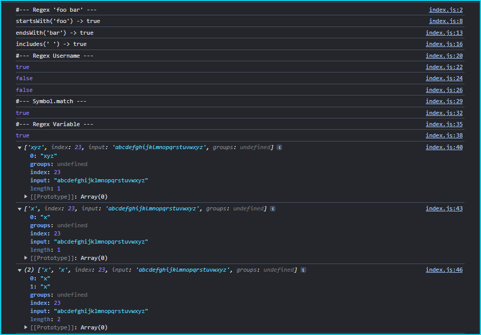
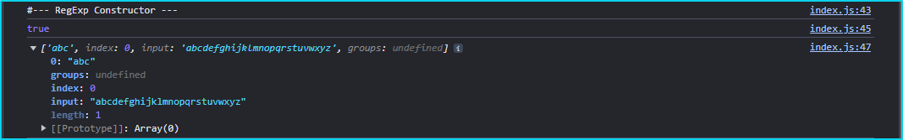
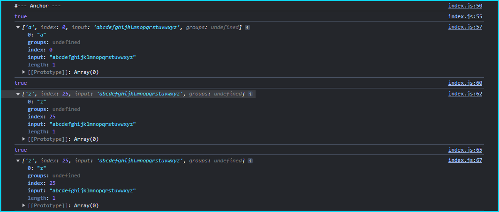
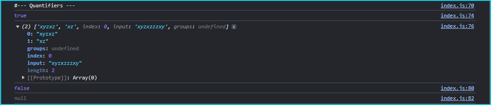
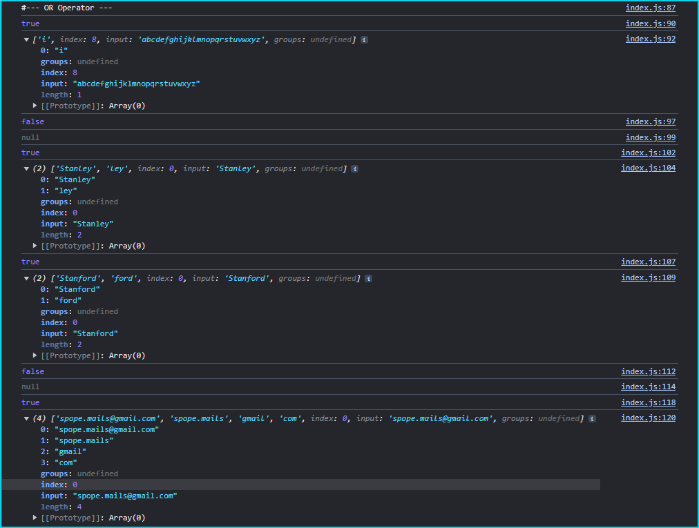
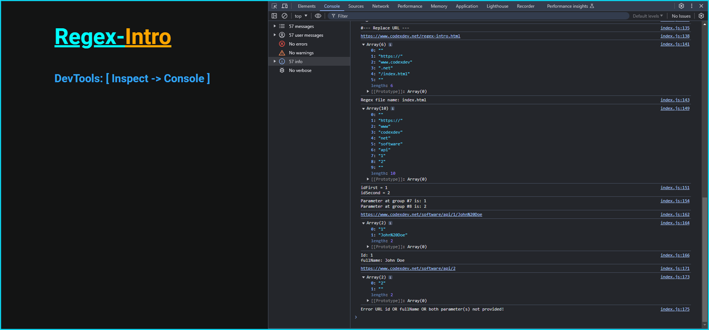

# regex-intro

Regular Expression commonly reffered as regex or regexp is a valuable tool in performing operations on strings like finding predefined paterns inside the given text, checking valid format of usernames, emails and passwords and so on. It consists of a sequence and combination of simple and special characters within slashes. 

# Regular Expression - Regex

One of the main composition of characters that represents Regular Expression sintax are `character classes`. Character classes are different types of regular expressions notation that are used to form particular pattern to match against input values or given text.

### Character Classes

| Character Class Type     | Description                                                                                                                                          |
| :----------------------: | :--------------------------------------------------------------------------------------------------------------------------------------------------- |
|     `[abc]`, `[a-c]`     | match enclosed characters or range if hyphen is used                                                                                                 |
|    `[^abc]`, `[^a-c]`    | negation of previous class which means not enclosed characters                                                                                       |
|          `\d`            | match single digit in the range 0 to 9 (`/\d/` or `/[0-9]/`)                                                                                         |
|          `\D`            | match single not digit character (`[^0-9]`)                                                                                                          |
|          `\w`            | match single word character, any alphanumeric character (`/\w/`) (including digits and underscore)                                                   |
|          `\W`            | match single not word character (e.g. especial character not used in regex, not latin alphabet characters...) `/\W/` equivalent to `/[^a-zA-Z0-9_]/` |
|          `\s`            | match character followed by whitespace (space, tab, return, newline, or fullstop). For example, `/\s\w*/` matches " bar" in "foo bar"                |
|          `\S`            | match character followed by nont whitespace. For example, `/\S\w*/` matches "foo" in "foo bar".                                                      |
|           `.`            | wildcard match any single character except line terminators                                                                                          |
|          `\t`            | matches a horizontal tab                                                                                                                             |
|          `\r`            | matches a carriage return                                                                                                                            |
|          `\n`            | matches a linefeed                                                                                                                                   |
|          `\v`            | matches a vertical tab                                                                                                                               |
|          `\f`            | matches a form-feed                                                                                                                                  |
|         `[\b]`           | matches a backspace                                                                                                                                  |
|          `\0`            | matches a NUL character (when not followed by another digit)                                                                                         |
|         `\xnn`           | matches the character code nn (two hexadecimal digits)                                                                                               |
|        `\unnnn`          | matches a UTF-16 code unit with the value nnnn (four hexadecimal digits)                                                                             |
|          `\`             | followed by a special character, means that the character should be matched literally.                                                               |

An example of regular expression variable in JavaScript that uses sequence of characters to validate client username is shown below.

```js
// regex for maching username
const regexUsername = /^[a-zA-Z0-9]{8,18}$/; // regex range class characters for maching username
console.log(regexUsername.test("username")); // RegExp.prototype.test(string) method match pattern against string and returns boolean, if match -> true; otherwise -> false
// -> true
console.log(regexUsername.test("user1"));
// -> false (length less then 8 chars)
console.log(regexUsername.test("@userNumber1"));
// -> false (special characters not allowed)
```

## Summary

This document tries to explain basics of regular expression, their processes, notation, elements and usages. Regex has it's own unique sintax described through Character Classes, Metacharacters, Flags, Capturing Groups, Breckets Expression, Quantifiers, Anchors and Operators which will be shown in the text below.

## Table of Contents

- [Character Classes](#character-classes)
- [Built-in Methods](#built-in-methods)
- [Regex Components](#regex-components)
- [Regex Literal Notation](#regex-literal-notation)
- [Regex Constructor](#regex-constructor)
- [Anchors](#anchors)
- [Quantifiers](#quantifiers)
- [OR Operator](#or-operator)
- [Metacharacters](#metacharacters)
- [Flags](#flags)
- [Bracket Expressions](#bracket-expressions)
- [Groups and Back-references](#groups-and-back-references)
- [License](#license)
- [Questions and Contacts](#questions-and-contacts)

## Built-in Methods

Built-in Methods like `String.prototype.endsWith()`, `startsWith()`, and `includes()` use strings to match text and throw a TypeError if the first argument is regex.

```js
const str1 = "foo bar";
// each method returns boolean if match -> true; otherwise -> false
const foo = str1.startsWith({ 
    toString: () => 'foo' 
});
console.log(`startsWith('foo') -> ${foo}`);
// -> true
const bar = str1.endsWith({ 
    toString: () => 'bar' 
});
console.log(`endsWith('bar') -> ${bar}`);
// -> true
const wspace = str1.includes(' ');
console.log(`includes(' ') -> ${wspace}`);
// -> true
```

If we would use regex inside following methods it would be a mistake because it is designed to match strings.

```js
// Any of the following will throw TypeError error
const re1 = str1.startsWith(/foo/);
const re2 = str1.endsWith(/bar/);
const wspc = str1.includes(/\s/);
// TypeError: First argument to String.prototype.includes must not be a regular expression
```

Alternatively, if we set `[Symbol.match]` to `false` object would not be considered as regular expression so instead regex1.toString() method will be used instead and TypeError error wouldn't' be thrown.

```js
const regex1 = /foo/;
regex1[Symbol.match] = false;
console.log("/foo/".startsWith(regex1));
// -> true
console.log("/foo/".startsWith(regex1.toString()));
// -> true
console.log("/foo/".startsWith({ 
    toString: () => "/foo/" 
}));
// -> true
```

# Regex Components

## Regex Literal Notation

Regular expression is a type of object which in literal notation represents a sequence of charactrs within slashes followed by optional flags after closing slash.

```js
const alpha = "abcdefghijklmnopqrstuvwxyz";
const regexp0 = /xyz/i; // regular expression variable /xyz/ with case-insensitive match i-flag 
console.log(regexp0.test(alpha));
// -> true
console.log(regexp0.exec(alpha));
// -> ['xyz']
const regexp1 = /[xyz]/g;
console.log(regexp1.exec(alpha));
// -> ['x']
const regexp2 = /([xyz])/g;
console.log(regexp2.exec(alpha));
// -> ['x', 'x']
```

### Inspect Console Object output image for regex components.

[](./app/assets/images/screenshots/inspect-regex-intro-bord.png)

## Regex Constructor

Regex Constructor defining a new regex object by providing regex expression as a first parameter and optional flag as a second.

```js
const regEx = new RegExp(/abc/, "i");
console.log(regEx.test(alpha));
// -> true
console.log(regEx.exec(alpha));
// -> ['abc']
```

### Inspect Console Object output image for RegExp Constructor.

[](./app/assets/images/screenshots/inspect-regex-intro-constructor-bord.png)

## Anchors

Characters like `^` (Caret), `$` (Dollar Sign) and `\d` (Word Boundary) are considered as anchors in regular expression notation. 

| Character | Name              | Description                                                                                                             | 
| :-----:   | :---------------- | :---------------------------------------------------------------------------------------------------------------------- |
|    `^`    | caret             | matching character(s) at the beginning of a expression pattern `/^[a-c]/`. When inside `/[^a-c]/` pattern it's negation |
|    `$`    | dollar sign       | character represent end of expression patterern `/[a-c]$/`                                                              | 
|   `\b`    | word boundary     | character means that expression pattern requires to match a character at the end of the word(s)`/[x-z]\b/`              |
|   `\B`    | not word boundary | matching a character(s) at not word boundary point, where following character is of the same type `/[x-z]\B/`           |

Examples of anchors used in JavaScript as follows.

```js
const regExp11 = /^[a-c]/;
const regExp12 = /z$/;
const regExp13 = /[x-z]\b/;

console.log(regExp11.test(alpha));
// -> true
console.log(regExp11.exec(alpha));
// -> ['a']
console.log(regExp12.test(alpha));
// -> true
console.log(regExp12.exec(alpha));
// -> ['z']
console.log(regExp13.test(alpha));
// -> true
console.log(regExp13.exec(alpha));
// -> ['z']
```

### Inspect Console Object output image for Regex Anchors.

[](./app/assets/images/screenshots/inspect-regex-intro-anchor-bord.png)

## Quantifiers

Quantifiers setting up the required number of caracters in a sequence or number of times that character can be repeated to match predefined pattern against input values.

### Table of Regex `Quantifiers`

|   Character   | Description                                                                                                    |
| :-----------: | :------------------------------------------------------------------------------------------------------------- |
|       `x?`    | regex type character(s) -> pattern _(x)_ 0 or 1 time                                                           |
|       `x*`    | regex type character(s) -> pattern _(x)_ zero or more times                                                    |
|       `x+`    | regex type character(s) -> pattern _(x)_ 1 or more times                                                       |
|     `x{n}`    | regex type character(s) -> pattern _(x)_ (_n_) - number of times where _n_ is positive integer                 |
|     `x{8}`    | regex type character(s) -> pattern _(x)_ exactly 8 times (characters)                                          |
|    `x{8,}`    | regex type character(s) -> pattern _(x)_ 8 or more times (characters)                                          |
| `x{8, 16}`    | regex type character(s) -> pattern _(x)_ 8 or up to 16 times (characters). Otherwise notation is `x{min, max}` |

Regullar expression in JavaScript by using Quantifiers with example below.

```js
const regexp = /(x+y*z?){2,6}/;

const strQuantifierTest = "xyzxzzzxy";
console.log(regexp.test(strQuantifierTest));
// -> true
console.log(regexp.exec(strQuantifierTest));
// -> ['xyzxz', 'xz']
const strQuantifierTestII = "xyzzzxyz";
console.log(regexp.test(strQuantifierTestII));
// -> false
console.log(regexp.exec(strQuantifierTestII));
// -> null
// regular expression rule demands that it cannot be two times `z` in a row (before expression repeates at least 2 times {2,6} while up to 6 times is optional) 
// because if you have z more then once, you should have x before z in those 2 times minimum. That expression pattern is required to repeat 2 times minimum.
```

### Inspect Console Object output image for Regex Quantifiers.

[](./app/assets/images/screenshots/inspect-regex-intro-quantifiers-bord.png)

## OR Operator

Operator OR means one, another or both in logical comparisation. In regex expression using OR operators can be used by pipe sign ( | ).

| Character  | Name | Description         |
| :--------: | :--- | :------------------ |
|    `\|`    | Pipe | Logical OR operator |

OR Operator in general with example.

```js
const regexOr = /(?:i|j|k)/; // esuvalent as /[abc]/
console.log(regexOr.test(alpha));
// -> true
console.log(alpha.match(regexOr));
// -> ['i']

const regexOrName = /^Stan(ley|ford)?$/;
console.log(regexOrName.test("ford"));
// -> false
console.log(regexOrName.exec("ford"));
// -> null
console.log(regexOrName.test("Stanley"));
// -> true
console.log(regexOrName.exec("Stanley"));
// -> ['Stanley', 'ley']
console.log(regexOrName.test("Stanford"));
// -> true
console.log(regexOrName.exec("Stanford"));
// -> ['Stanford', 'ford']
console.log(regexOrName.test("Standard"));
// -> false
console.log(regexOrName.exec("Standard"));
// -> null
```

OR Operator in an email example.

```js
const regexOrEmail = /^([\w.]+)@([\w.]+)\.(com|edu|net)$/;
console.log(regexOrEmail.test("spope.mails@gmail.com"));
// -> true
console.log(regexOrEmail.exec("spope.mails@gmail.com"));
// -> ['spope.mails@gmail.com', 'spope.mails', 'gmail', 'com']
// this regex match email composition in three capturing groups from which last one giving the options to end domain address with .com, .edu or .net

// if -> else statement for regex test return 
const testRegex = regexOrEmail.test("spope.mails@gmail.com");
(!testRegex) ? console.log(`regex returned -> ${testRegex}`) : console.log(`regex returned -> ${testRegex}`);
// -> regex returned -> true
```
### Inspect Console Object output image for Regex OR operator.

[](./app/assets/images/screenshots/inspect-regex-intro-oroperator-bord.png)

## Metacharacters

| Metacharacter | Bracket Expression | Description                                                                       |
| :------------:| :----------------- | :-------------------------------------------------------------------------------- |
|      `\d`     | [0-9]              | match single digit in the range                                                   |
|      `\D`     | [^0-9]             | match single not digit character                                                  |
|      `\s`     | [\t\r\n\f]         | match character followed by whitespace (space, tab, return, newline, or fullstop) |
|      `\S`     | [^\t\r\n\f]        | match character followed by not whitespace                                        |
|      `\w`     | [a-zA-Z0-9_]       | match single word character (including digits and underscore)                     |
|      `\W`     | [^a-zA-Z0-9_]      | match single not word character                                                   |
|       `.`     | [a-zA-Z0-9_...]    | wildcard match any single character except line terminators                       |

- Litteral dot expression when using in pattern ( `\.` ) 

## Flags

|  Flag  | Description                                                             |
| :----: | :---------------------------------------------------------------------- |
|   `g`  | performs a global match, finding all matches rather than just the first |
|   `i`  | makes matches case-insensitive, matches both uppercase and lowercase    |
|   `m`  | performs multiline matches                                              |
|   `s`  | allows `.` to match newline characters                                  |
|   `u`  | enables Unicode support                                                 |
|   `y`  | matches are sticky, looking only at exact position in the text          |

## Bracket Expressions

| Character | Name            | Description                                                                 |
| :-------: | :-------------: | :-------------------------------------------------------------------------- |
|   `[ ]`   | Square Brackets | creates character group or range `[a-zA-Z0-9]`                              |
|   `{ }`   | Curly Braces    | creates specific numerical quantifier range `{3, 6}`                        |
|   `( )`   | Parentheses     | creates sub-sequence or sub-group of character(s) in the pattern `([\w.]+)` |

## Groups and Back-references

Considering regex pattern `/^(https?:\/\/)?([\da-z\.-]+)(\.[a-z\.]{2,6})([\/\w\.-]*)*\/?$/`. Several groups can be identified. Check table below.

| Regex pattern                                                         | Captured group  | Description                                                                   |
| :-------------------------------------------------------------------- | :-------------: | :---------------------------------------------------------------------------- |
|   `^(https?:\/\/)?([\da-z\.-]+)(\.[a-z\.]{2,6})([\/\w\.-]*)*\/?$`     |       `$0`      | Regex group `$0` is a whole pattern                                           |
|   `(https?:\/\/)`                                                     |       `$1`      | Regex group `$1` represents a pattern contained in 1<sup>th</sup> parentheses |
|   `([\da-z\.-]+)`                                                     |       `$2`      | Regex group `$2` represents a pattern contained in 2<sup>nd</sup> parentheses |
|   `(\.[a-z\.]{2,6})`                                                  |       `$3`      | Regex group `$3` represents a pattern contained in 3<sup>rd</sup> parentheses |
|   `([\/\w\.-]*)`                                                      |       `$4`      | Regex group `$4` represents a pattern contained in 4<sup>th</sup> parentheses |

### Replace URL example for given regex pattern (matching url)

```js
const regexURL = /^(https?:\/\/)?([\da-z\.-]+)(\.[a-z\.]{2,6})([\/\w\.-]*)*\/?$/;
const strURL = "https://www.codexdev.net/index.html";
console.log(strURL.replace(regexURL, `$1$2$3/regex-intro.html`));
// -> https://www.codexdev.org/regex-intro.html
const dis = strURL.split(regexURL);
console.log(dis);
// -> ['', 'https://', 'www.codexdev', '.net', '/index.html', '']
console.log(`Regex file name: ${dis[4].replace("\/", "")}`);
// -> Regex file name: index.html

const regexParam = /^(https?:\/\/)?(w{3})?\.([a-z0-9\.-]*)\.(com|net|edu|biz|co)\/?(\w*\.?\w*?)*?\/?(\w*)\/?([0-9])*?\/?([0-9])*\/?$/;
const strParamURL = "https://www.codexdev.net/software/api/1/2";
const ans = strParamURL.split(regexParam);
console.log(ans);
// ->  ['', 'https://', 'www', 'codexdev', 'net', 'software', 'api', '1', '2', '']
console.log(strParamURL.replace(regexParam, `idFirst = $7\nidSecond = $8`));
// -> idFirst = 1
// -> idSecond = 2
console.log(`Parameter at group #7 is: ${ans[7]}\nParameter at group #8 is: ${ans[8]}`);
// -> Parameter at group #7 is: 1
// -> Parameter at group #8 is: 2

const regexParamURL0 = /^(https?:\/\/)?(w{3})?\.([a-z0-9\.-]*)\.(com|net|edu|biz|co)\/?(\w*\.?\w*?)*?\/(\w*)\/?(\w)*\/?([\w\%20\w]*)*\/?$/;

const strParamURL0 = "https://www.codexdev.net/software/api/1/John%20Doe";
const idURL0 = strParamURL0.replace(regexParamURL0, `$7 $8`);
console.log(strParamURL0);
// -> https://www.codexdev.net/software/api/1/John%20Doe
console.log(idURL0.split(" "));
// -> ['1', 'John%20Doe']
(!idURL0.split(" ")[0] || !idURL0.split(" ")[1]) ? console.log(`Error URL id OR fullName OR both parameter(s) not provided!`) : console.log(`Id: ${idURL0.split(" ")[0]}\nfullName: ${idURL0.split(" ")[1].split("%20").join(" ")}`);
// -> Id: 1
// -> fullName: John Doe

const strParamURL1 = "https://www.codexdev.net/software/api/2";
const idURL1 = strParamURL1.replace(regexParamURL0, `$7 $8`);
console.log(strParamURL1);
// -> https://www.codexdev.net/software/api/2
console.log(idURL1.split(" "));
// -> ['2', '']
(!idURL1.split(" ")[0] || !idURL1.split(" ")[1]) ? console.log(`Error URL id OR fullName OR both parameter(s) not provided!`) : console.log(`Id: ${idURL1.split(" ")[0]}\nfullName: ${idURL1.split(" ")[1].split("%20").join(" ")}`);
// -> Error URL id OR fullName OR both parameter(s) not provided!
```
### Meaning of `/^(https?:\/\/)?([\da-z\.-]+)(\.[a-z\.]{2,6})([\/\w\.-]*)*\/?$/` regex should be explained as follows:

1. Start at the beginning of the text (`only`) and find optional (`?`) pattern `http` with optional `s` (`http | https`) folowed by two literal forward slashes. Also, this is captured group has notation `$1`. Tis group is completly optional.
2. Previous group is optional and should be folowed by any digit (`\d`) or lowercase alphabet letter range (`[a-z]`), folowed by literal dot (`\.`) and hyphen (`-`). Also, this range should be repeated at least once or more as there is (`+`), which means 1 or more times. This is captured group with notation `$2`.
3. Next sequence is composed of literal dot (`\.`) folowed by range of any alphabet lowercase letter (`[a-z]`) folowed by literal dot (`\.`). This sequence should be repeated at least 2 times minimum, but up to 6 times because of metacharacter notation (`{2,6}`). Group has notation of `$3`.
4. Last one group consists of sequence starting with literal forward slash (`\/`) folowed by any word character (`\w`) folowed by literal dot (`\.`) or hyphen (`-`). Sequence of characters can be repeated 0 or more times, because there is a (`*`) asterix metacharacter after the sequence. Also, the all group can be repeated 0 or more times (`*`), because asterix metacharacter after sequence (`([ ]*)*`). This is a group with notation `$4`.
5. Regex pattern ends with optional literal forward slash (`\/?`) folowed by dollar sign (`$`) which means the far end of the expression or just end of regex. 

### Breaf conclusion about regex matching URL 

- Pattern as `/(https?:\/\/)?([\da-z\.-]+)(\.[a-z\.]{2,6})([\/\w\.-]*)*\/?$/` should be used if you want to match more generic or whole part of URL address in text at once and to change it in something else or to change it's format. 

- On the other hand if you need to extract part of URL to search for IDs or other parameters you may prefere this `/(https?:\/\/)?(w{3})?\.([a-z0-9\.-]*)\.(com|net|edu|biz|co)\/?(\w*\.?\w*?)*?\/?(\w*)\/?([0-9])*?\/?([0-9])*\/?$/` pattern because pattern do not include litteral dots or slashes within sequence groups so if you need an parameter you search for groups (`$7` or `$8`) where parameters should be. 

### Inspect Console Object output image.

[](./app/assets/images/screenshots/regex-intro-bord.png)

- Testing tool for regular expression sequences used for this purpose you can find [here](https://regexr.com/), but you can find many other as well.

## License

Copyright © 2024, [codexdev](https://github.com/strahinjapopovic/regex-intro). Released under the [MIT License](./LICENSE).

## Questions and Contacts

Questions about application can be reffered to the author's [GitHub account](https://github.com/strahinjapopovic) or you can [Contact Me](mailto:spope.mails@gmail.com) directly over an email.

Repository over [GitHub account][1] and [GitHub gist][2].

[1]: https://github.com/strahinjapopovic                 "GitHub account"
[2]: https://gist.github.com/strahinjapopovic            "GitHub gist"
